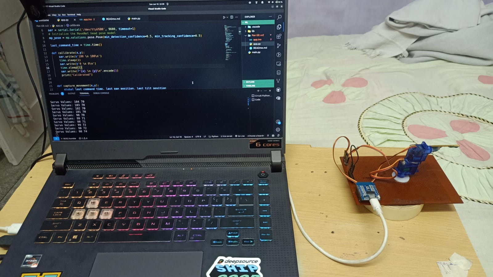
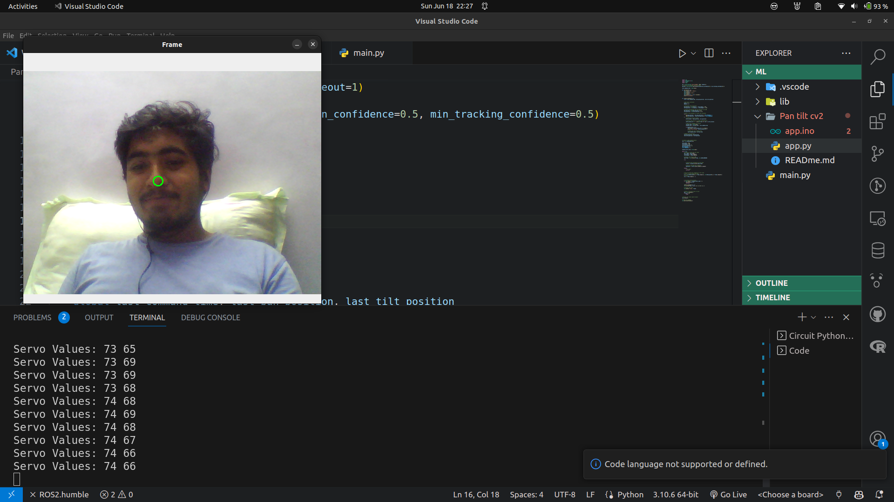
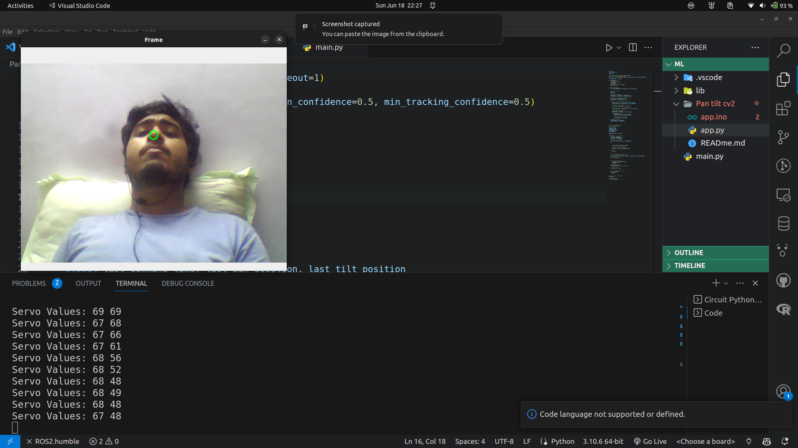
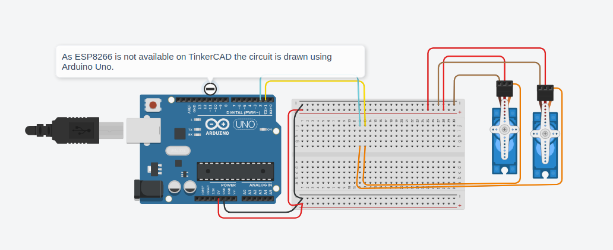
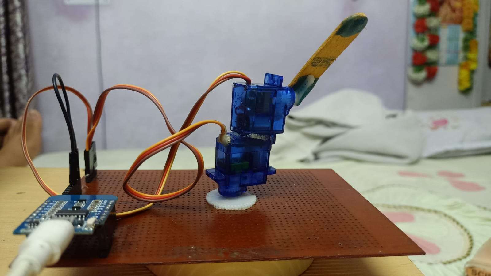

# Computer Vision with Pan Tilt Servo Motors

This project is focused on computer vision integration with pan tilt servo motors. It utilizes MediaPipe to detect head pose and then moves the servos to track the detected head pose.

The project preprocesses the data and sends it to the servo motors through serial communication. The microcontroller used in this project is ESP8266, and the servo motors employed are SG90.

## Requirements
- Python 3.7+
- OpenCV-contrib-python
- mediapipe
- pyserial

## Usage
To use this project, follow these steps:

1. Clone the repository to your local machine.
2. Install the required dependencies mentioned above.
3. Connect the ESP8266 microcontroller to your computer and flash the app.ino to ESP8266.
4. Connect the SG90 servo motors to the appropriate GPIO pins on the ESP8266.
5. Modify the serial port configuration in the script to match the port of the ESP8266. 
6. Run the script from the command line or your preferred Python IDE.
7. The script will start capturing video from the webcam and detect the head pose using MediaPipe.
8. The servo motors will adjust their position based on the detected head pose.
9. Press 'Esc' to quit the program.

## Code Snippet
to clone and run the project, run the following commands:
``` 
git clone
cd
python main.py
```

Images:







<br>
Please ensure that you have the necessary hardware components and proper wiring connections before running the script.

Feel free to customize the code to suit your specific requirements, such as adjusting the servo motor angles, changing the microcontroller, or adding additional functionality.

Enjoy exploring computer vision with pan tilt servo motors!

For more detailed instructions, code snippets, and examples, refer to the project repository.
